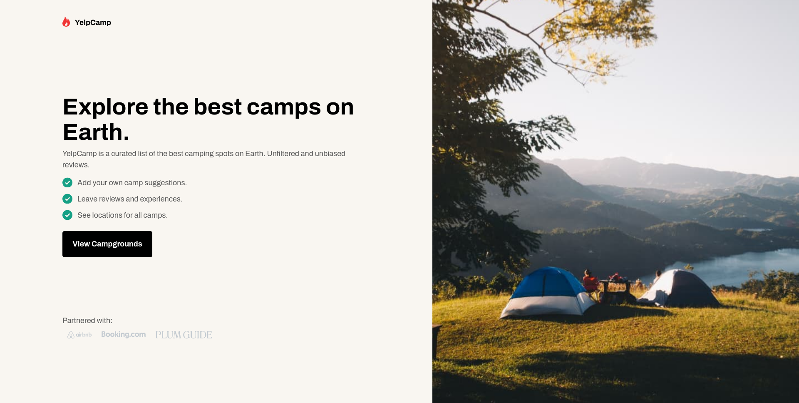

# Codewell - YelpCamp

This is a solution to [YelpCamp](https://www.codewell.cc/challenges/yelpcamp-by-colt-steele--6144c7c8a383e41090a3d84b). 

## Table of contents

- [Overview](#overview)
  - [Screenshot](#screenshot)
  - [Links](#links)
- [My process](#my-process)
  - [Built with](#built-with)
  - [What I learned](#what-i-learned)
  - [Continued development](#continued-development)
- [Author](#author)

## Overview

### Screenshot

### Links

- Solution URL: [Order summary card](https://github.com/LuisCBeltran/YelpCamp)
- Live Site URL: [YelpCamp](https://luiscbeltran.github.io/YelpCamp/)

## My process

### Built with

- Pug
- Sass
- Flexbox
- Mobile-first workflow
- JavaScript

### What I learned

This is the first project with different web pages. I used a modular approach for the first time.

### Continued development

Although I used a modular approach, I could used more frequently to improve my productivity.

## Author

- Website - [Luis C. Beltrán](https://github.com/LuisCBeltran)
- Frontend Mentor - [@LuisCBeltran](https://www.frontendmentor.io/profile/LuisCBeltran)
- Twitter - [@luisc_beltran](https://twitter.com/luisc_beltran)

